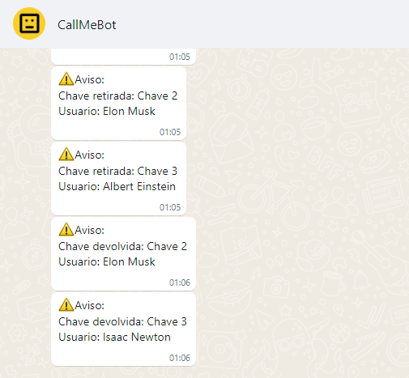

##Controle de Acesso com Arduino e ESP32
Este projeto consiste em um sistema de controle de acesso desenvolvido com Arduino e ESP32, integrado à API do WhatsApp CallMeBot para notificação automática via mensagem quando uma chave é retirada ou devolvida ao local.
'''

'''
Funcionalidades
Notificação automática via WhatsApp ao retirar ou devolver uma chave.
Monitoramento em tempo real do estado das chaves.
Hardware Necessário
Placa Arduino (exemplo: Arduino Uno)
Placa ESP32 (ou módulo ESP8266)
Módulo de relé para controle dos dispositivos de segurança
Smartphone com WhatsApp para recebimento das notificações
Instalação e Configuração

cpp
Copy code
#define WHATSAPP_BOT_TOKEN "seu_token"
#define WHATSAPP_DESTINO "seu_numero_de_telefone"
Carregue o firmware para as placas Arduino e ESP32 utilizando a Arduino IDE ou outra ferramenta compatível.

Monte o hardware conforme o esquemático fornecido nos arquivos em pdf.

Inicie o sistema e teste o funcionamento.

Contribuição
Contribuições são bem-vindas! Se você encontrar problemas, bugs ou tiver sugestões de melhorias, sinta-se à vontade para abrir uma issue ou enviar um pull request.

Autores
Igor Gomes
